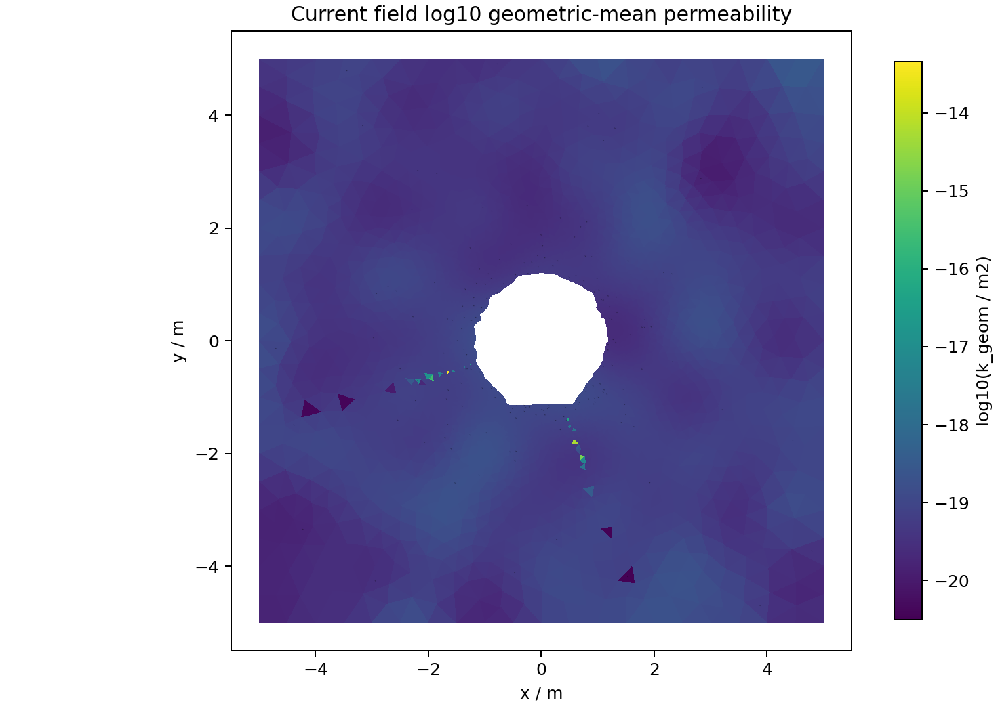
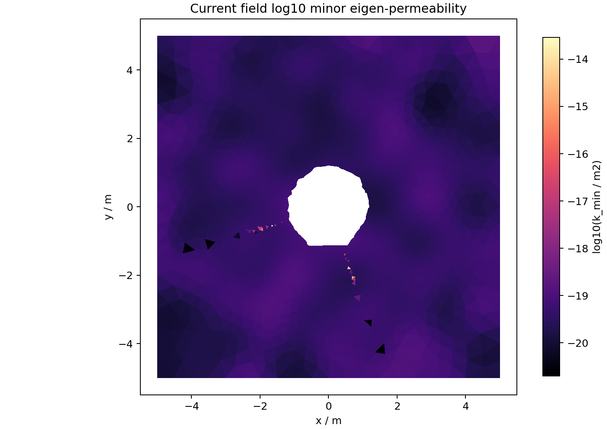
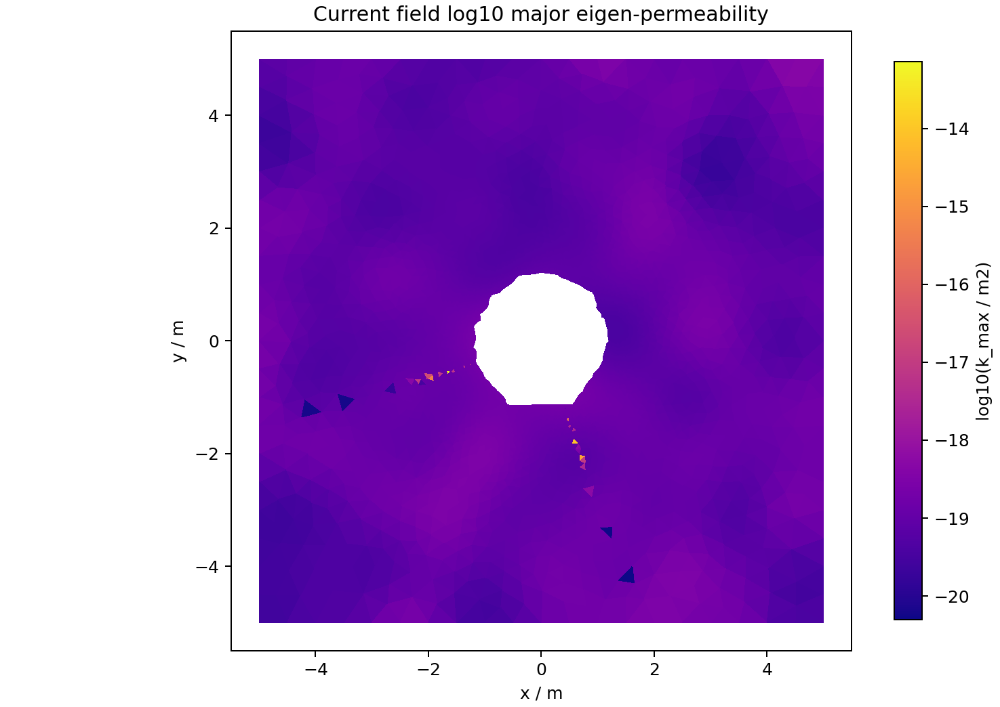
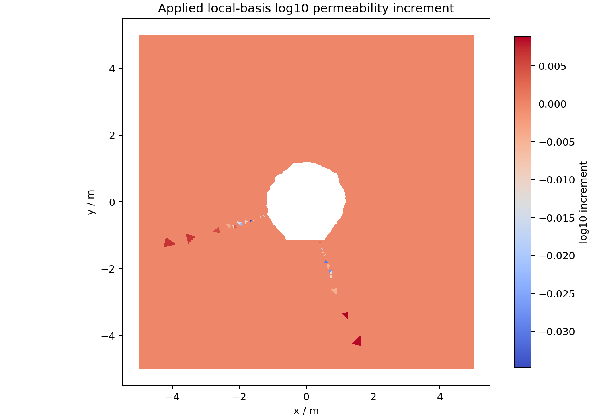
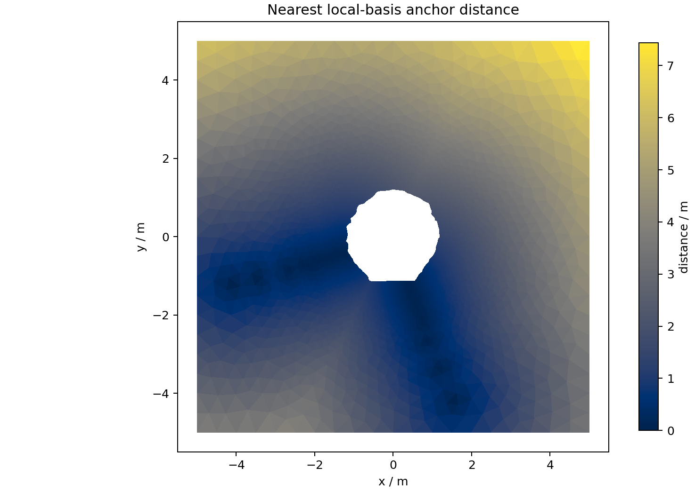
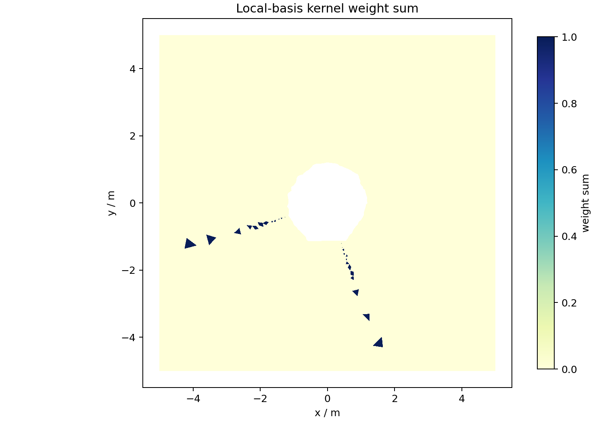

# Current Field Visual Inspection

This generated page renders the packaged current permeability-field VTU as
cell-wise inspection maps. It is a QA view of the active-objective incumbent,
not a final all-measurement promotion decision.

## Summary

- Status: `current_field_visual_inspection_generated`
- Source mesh: `inversion_workflow/current_permeability_field/current_best_bulk_w_projections.vtu`
- Current field run: `local_basis_sampler_002_basis_024_det_l_0p0075_s_1p000`
- Deliverable status: `best_executed_active_objective_candidate_not_final_all_measurement_inversion`
- Triangle cells rendered: 10239
- Positive-definite rendered cells: 10239
- Images generated: 6

## Images

## Metric Summary

| Metric | p05 | p50 | p95 | max |
| --- | ---: | ---: | ---: | ---: |
| `log10_k_geom_m2` | -19.569576889472998 | -19.18631235241345 | -18.903038056343412 | -13.344353126747192 |
| `log10_k_eigen_min_m2` | -19.768546893809017 | -19.385282356749467 | -19.10200806067943 | -13.543323131083211 |
| `log10_k_eigen_max_m2` | -19.37060688513698 | -18.98734234807743 | -18.704068052007393 | -13.145383122411173 |
| `anisotropy_ratio` | 2.499999999999999 | 2.4999999999999996 | 2.5000000000000004 | 2.5000000000000013 |
| `theta_deg` | 144.0 | 144.0 | 144.0 | 144.0 |
| `k_mag_rd_m2` | 2.703857478056863e-20 | 6.510311241242571e-20 | 1.2446525219422006e-19 | 2.841854729087051e-19 |
| `local_basis_applied_log10_increment` | 0.0 | 0.0 | 0.0 | 0.00885024756522411 |
| `smooth_applied_log10_multiplier` | 0.0 | 0.0 | 0.0 | 5.838846276907379 |
| `local_basis_nearest_anchor_distance_m` | 0.1655942081433988 | 1.3341074008425977 | 3.7666646341910783 | 7.433553778706038 |
| `local_basis_weight_sum` | 0.0 | 0.0 | 0.0 | 1.0 |
| `n_rd` | 0.105 | 0.105 | 0.105 | 0.105 |

## Interpretation

The current field keeps a fixed bedding-informed tensor orientation and fixed
anisotropy ratio while applying smooth and local-basis magnitude changes. The
visual maps make the spatial support of those magnitude changes inspectable
next to the metric summary, and should be regenerated whenever the packaged
current field changes.
