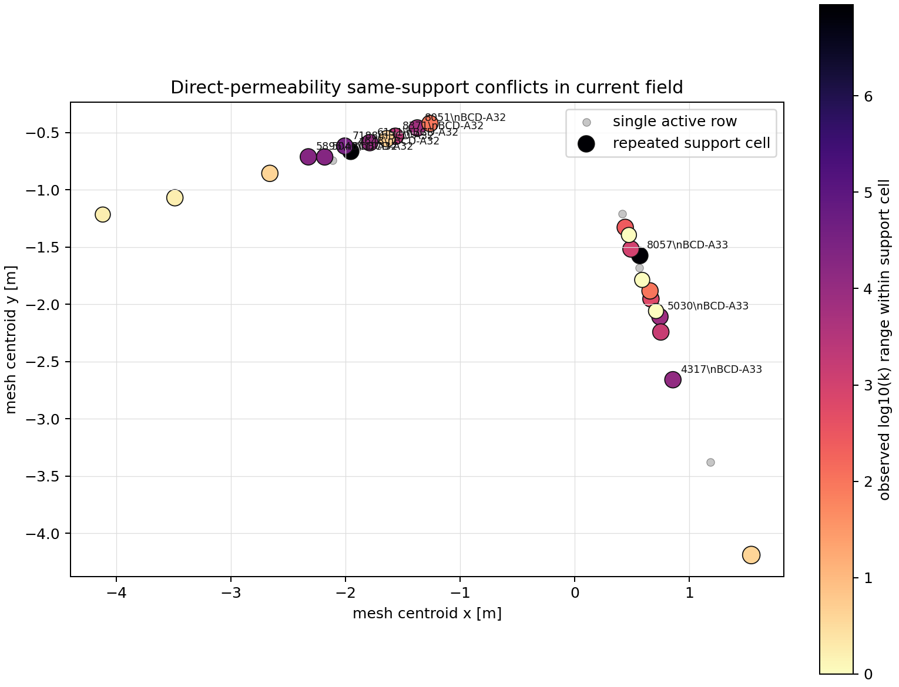

# Permeability Support-Conflict Spatial Audit

This diagnostic maps the active direct-permeability support cells onto the
current OGS mesh. It is a visualization/audit layer only; it does not change
likelihood semantics, field values, OGS inputs, or promotion decisions.

- Status: `permeability_support_conflict_spatial_audit_generated`
- Mesh cells: 10239
- Active support cells: 30
- Repeated support cells: 24
- Support cells with observed range >= 1 log10: 16
- Support cells with observed range >= 2 log10: 16
- Configured-scalar range conflict cells: 1

## Highest-Conflict Support Cells

| Cell | Class | Rows | Segments | Depth range [m] | Observed range | Max abs residual | x [m] | y [m] |
| ---: | --- | ---: | --- | --- | ---: | ---: | ---: | ---: |
| 4648 | `configured_scalar_range_conflict` | 3 | `BCD-A32` | 0.85-0.87 | 6.949 | 3.474 | -1.953 | -0.6655 |
| 8057 | `large_same_support_observation_conflict` | 3 | `BCD-A33` | 0.55-0.59 | 6.903 | 3.452 | 0.5683 | -1.575 |
| 7188 | `large_same_support_observation_conflict` | 3 | `BCD-A32` | 0.95-1.01 | 4.574 | 2.287 | -2.005 | -0.6193 |
| 5040 | `large_same_support_observation_conflict` | 3 | `BCD-A32` | 1.15-1.15 | 4.301 | 2.151 | -2.18 | -0.714 |
| 5896 | `large_same_support_observation_conflict` | 3 | `BCD-A32` | 1.25-1.29 | 4.301 | 2.151 | -2.323 | -0.7132 |
| 4317 | `large_same_support_observation_conflict` | 3 | `BCD-A33` | 1.7-1.7 | 4.097 | 2.048 | 0.8573 | -2.659 |
| 6191 | `large_same_support_observation_conflict` | 3 | `BCD-A32` | 0.65-0.73 | 4 | 2 | -1.787 | -0.5892 |
| 5030 | `large_same_support_observation_conflict` | 3 | `BCD-A33` | 1.15-1.15 | 3.891 | 1.945 | 0.744 | -2.109 |
| 8051 | `large_same_support_observation_conflict` | 3 | `BCD-A32` | 0.25-0.31 | 3.824 | 1.912 | -1.373 | -0.4612 |
| 8371 | `large_same_support_observation_conflict` | 3 | `BCD-A32` | 0.45-0.45 | 3.398 | 1.699 | -1.564 | -0.5334 |
| 5749 | `large_same_support_observation_conflict` | 3 | `BCD-A33` | 1.25-1.29 | 3.176 | 1.588 | 0.7517 | -2.242 |
| 3600 | `large_same_support_observation_conflict` | 3 | `BCD-A33` | 0.45-0.45 | 3 | 1.5 | 0.4913 | -1.518 |
| 4650 | `large_same_support_observation_conflict` | 3 | `BCD-A33` | 0.95-1.01 | 2.778 | 1.389 | 0.6655 | -1.953 |
| 4096 | `large_same_support_observation_conflict` | 3 | `BCD-A33` | 0.25-0.31 | 2.398 | 1.199 | 0.4412 | -1.329 |
| 4649 | `large_same_support_observation_conflict` | 3 | `BCD-A33` | 0.85-0.87 | 2 | 1 | 0.6575 | -1.883 |

## Interpretation

The dominant direct-permeability residuals are spatially concentrated in repeated support cells. This supports the existing stop gate: another one-value-per-support-cell field in the same support map cannot remove mutually inconsistent pulse-test rows assigned to the same OGS cell.
The plotted cells are the same support cells used by the existing residual,
likelihood-policy, and support lower-bound audits. The largest conflicts
therefore represent observation-support/likelihood choices rather than a
missing spatial degree of freedom in the current one-value-per-support-cell map.

## Source Artifacts

- `inversion_workflow/permeability_residual_conflict_audit.csv`
- `inversion_workflow/permeability_residual_support_cell_audit.csv`
- `inversion_workflow/permeability_likelihood_policy_group_summary.csv`
- `inversion_workflow/current_permeability_field/current_best_bulk_w_projections.vtu`